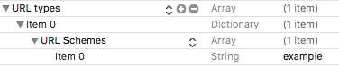

<p align="center">
  
</p>

<p align="center">
  <a href="https://travis-ci.org/luisfcofv/react-native-deep-linking"></a>
  <a href="https://codecov.io/github/luisfcofv/react-native-deep-linking"></a>
  <a href="http://npm.im/react-native-deep-linking"></a>
  <a href="http://npm-stat.com/charts.html?package=react-native-deep-linking&from=2017-02-13"></a>
  <a href="LICENSE"></a>
  <a href="https://github.com/semantic-release/semantic-release"></a>
  <a href="https://greenkeeper.io/"></a>
</p>

## Overview

React Native route-matching library to handle deep links.

## Installation

This package is distributed via npm:

```
npm install react-native-deep-linking
```

### Add deep link support to your app

#### For iOS:

#### 1. Make sure you have a URL scheme registered for your app in your Info.plist



#### 2. Add this to your AppDelegate.m

```objective-c
#import "RCTLinkingManager.h"

- (BOOL)application:(UIApplication *)application openURL:(NSURL *)url
  sourceApplication:(NSString *)sourceApplication annotation:(id)annotation
{
  return [RCTLinkingManager application:application openURL:url
                      sourceApplication:sourceApplication annotation:annotation];
}

// Only if your app is using [Universal Links](https://developer.apple.com/library/prerelease/ios/documentation/General/Conceptual/AppSearch/UniversalLinks.html).
- (BOOL)application:(UIApplication *)application continueUserActivity:(NSUserActivity *)userActivity
 restorationHandler:(void (^)(NSArray * _Nullable))restorationHandler
{
 return [RCTLinkingManager application:application
                  continueUserActivity:userActivity
                    restorationHandler:restorationHandler];
}
```

#### For Android:
https://developer.android.com/training/app-indexing/deep-linking.html

More info: https://facebook.github.io/react-native/docs/linking.html

## Usage

#### 1. Import DeepLinking
```javascript
import DeepLinking from 'react-native-deep-linking';
```

#### 2. Register schemes
```javascript
DeepLinking.addScheme('example://');
```

#### 3. Add event listener
```javascript
import { Linking } from 'react-native';

Linking.addEventListener('url', handleUrl);

const handleUrl = ({ url }) => {
  Linking.canOpenURL(url).then((supported) => {
    if (supported) {
      DeepLinking.evaluateUrl(url);
    }
  });
};
```

#### 4. Register routes
```javascript
DeepLinking.addRoute('/test/:id', (response) => {
  // example://test/23
  console.log(response.id); // 23
});
```

#### 5. Open external url (Optional)
If your app was launched from an external url registered to your app you can access and handle it from any component you want with
```javascript
componentDidMount() {
  var url = Linking.getInitialURL().then((url) => {
    if (url) {
      Linking.openURL(url);
    }
  }).catch(err => console.error('An error occurred', err));
}
```

## Example

```javascript
import React, { Component } from 'react';
import { Button, Linking, StyleSheet, Text, View } from 'react-native';

import DeepLinking from 'react-native-deep-linking';

export default class App extends Component {
  state = {
    response: {},
  };

  componentDidMount() {
    DeepLinking.addScheme('example://');
    Linking.addEventListener('url', this.handleUrl);

    DeepLinking.addRoute('/test', (response) => {
      // example://test
      this.setState({ response });
    });

    DeepLinking.addRoute('/test/:id', (response) => {
      // example://test/23
      this.setState({ response });
    });

    DeepLinking.addRoute('/test/:id/details', (response) => {
      // example://test/100/details
      this.setState({ response });
    });

    Linking.getInitialURL().then((url) => {
      if (url) {
        Linking.openURL(url);
      }
    }).catch(err => console.error('An error occurred', err));
  }

  componentWillUnmount() {
    Linking.removeEventListener('url', this.handleUrl);
  }

  handleUrl = ({ url }) => {
    Linking.canOpenURL(url).then((supported) => {
      if (supported) {
        DeepLinking.evaluateUrl(url);
      }
    });
  }

  render() {
    return (
      <View style={styles.container}>
        <View style={styles.container}>
          <Button
            onPress={() => Linking.openURL('example://test')}
            title="Open example://test"
          />
          <Button
            onPress={() => Linking.openURL('example://test/23')}
            title="Open example://test/23"
          />
          <Button
            onPress={() => Linking.openURL('example://test/100/details')}
            title="Open example://test/100/details"
          />
        </View>
        <View style={styles.container}>
          <Text style={styles.text}>{this.state.response.scheme ? `Url scheme: ${this.state.response.scheme}` : ''}</Text>
          <Text style={styles.text}>{this.state.response.path ? `Url path: ${this.state.response.path}` : ''}</Text>
          <Text style={styles.text}>{this.state.response.id ? `Url id: ${this.state.response.id}` : ''}</Text>
        </View>
      </View>
    );
  }
}

const styles = StyleSheet.create({
  container: {
    flex: 1,
    justifyContent: 'center',
    alignItems: 'center',
  },
  text: {
    fontSize: 18,
    margin: 10,
  },
});
```

## Routes

The format of a deep link URL is the following: `<scheme>://<host>/<path-component>`

Example `facebook://profile`
```javascript
// The following route matches the URL.
DeepLinking.addRoute('/profile', ({ scheme, path }) => {
  console.log(scheme); // `facebook://`
  console.log(path);   // `/profile`
});

// The following route does NOT match the URL.
DeepLinking.addRoute('profile', () => { ... });
```

Example `facebook://profile/33138223345`
```javascript
// The following route matches the URL.
DeepLinking.addRoute('/profile/:id', ({ scheme, path, id }) => {
  console.log(scheme); // `facebook://`
  console.log(path);   // `/profile/33138223345`
  console.log(id);     // `33138223345`
});
```

Example `facebook://profile/12/posts/403`
```javascript
// The following route does NOT match the URL.
DeepLinking.addRoute('profile/:id/posts/:postId', ({ scheme, path, id, postId }) => {
  console.log(scheme); // `facebook://`
  console.log(path);   // `/profile/12/posts/403`
  console.log(id);     // `12`
  console.log(postId); // `403`
});
```

### Regex Routes

Need something more powerful? You can add your own regex.

Example `facebook://profile/123/details`
```javascript
const regex = /\/profile\/(.*)\/details/g;
DeepLinking.addRoute(regex, ({ scheme, path, match }) => {
  console.log(scheme); // `facebook://`
  console.log(path);   // `/profile/33138223345/details`
  console.log(match);  // `[ "/profile/123/details", "123" ]`
});
```

## Contributing

Read up on our guidelines for [contributing](CONTRIBUTING.md).

## License

DeepLinking is licensed under the [MIT License](LICENSE).
